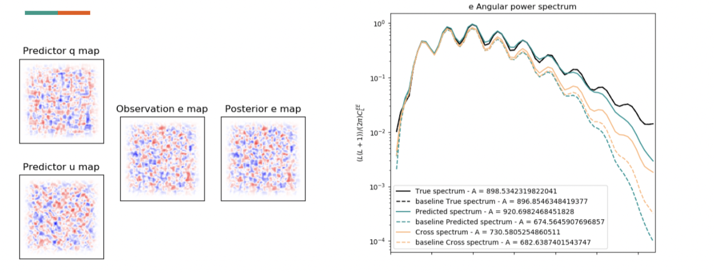

# CMB decomposition using StyleGAN2
**Author**: Manuel Blanco Valentin ([manuel.blanco.valentin@gmail.com](mailto://manuel.blanco.valentin@gmail.com))
<br/> **Based on**: [StyleGAN2-Tensorflow-2.0](https://github.com/manicman1999/StyleGAN2-Tensorflow-2.0) <br/>
**Collaborators**: João Caldeira, Brian Nord, Kimmy Wu, Clécio R. Bom
<br/>**Affiliation**: Computer & Electrical Eng. Department - Northwestern University

---

## Table of Contents
1. [Introduction to CMB](#Introduction-to-CMB)
2. [CMB decomposition](#CMB-decomposition)
3. [Previous Work](#Previous-work)
4. [Proposed Methodology - StyleGAN2-CMB](#Proposed-methodology-stylegan2-cmb)
5. [Experiments](#Experiments)
6. [Requirements](#Requirements)
7. [Future work](#Future-work)


## Introduction to CMB

[[go back to the top]](#Table-of-Contents)
The evidences that Hubble found about the apparent redshift of galaxies relative to each other (and us), as well as the 
recently proposed (at the time) theory of general relativity seem to indicate
that the fabric of space-time in our universe is constantly expanding at an accelerated rate.

These discoveries made Lemaître conclude that in order for the universe to be expanding 
its fabric, it must had begun in an extremely small and dense state. In fact, stretching this contraction back
until the limit, our current mathematical formulations and physical laws guide us to the contradiction of the singularity:
 the whole matter of the universe, condensed in an infinitessimal amount of space, with an extreme local density.

There is a point at which applying such equations and laws does not make any real sense, and most physicists even have trouble 
accepting the concept of the singularity itself. Instead they prefer to conclude that our current understanding of the 
universe is somehow limited, and thus the singularity itself is simply a consequence of our flawed science. 

Despite this, our current understanding of most part of the history of the universe is pretty extense. We might not be able
to apply our techniques to understand how the universe was before a certain point in time (when the universe was only nanoseconds
old), but we still can apply them to know how it was after that moment; in the part of the history of our universe that where
our science still holds. 

Right after the big bang, in a period known as **inflation**, the universe was so hot and condensed that atoms could not form.
Subatomic particles existed in a sort of quantic soup in form of plasma, due to the immense pressure and temperature. 
At this stage, the photons that were emitted during the interaction of the particles were immediately reabsorbed by other
particles, thus preventing them (and thus, light) to escape and to propagate outside of the plasma object. This phenomenon occurs, e.g.,
inside of our sun, where light might take up to 100,000 years to escape (see [here](https://www.abc.net.au/science/articles/2012/04/24/3483573.htm#:~:text=A%20photon%20of%20light%20takes,at%20the%20speed%20of%20light.)).

Once the universe was able to expand enough and cool down, the pressure was reduced, which allowed atoms to be formed. The
reduced density of the universe allowed the photons to escape and propagate along with the expanding universe for the very first time.
This last emission of light precisely describes how the structure of the universe was right after the big bang, how matter
was organized and distributed, which holds the key to understanding, for example, why there exist clusters of matter,
why there is an imbalance in the proportion of matter/antimatter, or even what is the origin of dark matter. 

This __snapshot__ of the early universe is precisely what we call **Cosmic microwave background radiation** or CMB. This radiation
can be seen absolutely everywhere in the universe, no matter where we point our telescopes to, and it always has the same
structure. 


**Figure 1.** Depiction of the evolution of the early universe right after the big bang.


**Figure 2.** Real image of the CMB captured by the satellite Planck.

## CMB decomposition

[[go back to the top]](#Table-of-Contents)

Although CMB contains a great amount of information regarding a great range of physical phenomena, the data in the raw maps as 
shown in **Figure 2** (in µK) is not directly useful. In order to extract useful information from these maps, it is necessary to
decompose them into different submaps, each one of them related to a certain property or phenomenon. 


**Figure 3.** Analytical equations used to decompose maps.
<br/>

#### - Why is CMB decomposition a hard task?
- Small size tiles
- Edge bleeding due to finite-size images
- Lensing effects (k)
- Flat-sky approximations
- Non-linear relationships
- b-modes are extremely faint (normalization required)

|  |  |  |
|:---:|:---:|:---:|
| q,u |  |  | 
| k |  | 
| e,b |  |  |

**Figure 4.** Example of decomposition of CMB.


The workflow that we are required to implement consists on:
```bash
- Convert maps q,u -> k,e,b
- Image2Image transformation
```


## Previous work

[[go back to the top]](#Table-of-Contents)

Previous work on lensing reconstruction of CMB with machine learning showed competitive results even for 
different levels of noise (see [DeepCMB][1]). On J. Caldeira's et al. work a UResNet is used in a image transformation 
problem and trained so that **e** and **k** maps can be obtained from sourced **q** and **u** lensed maps.  

### UResNet (2018-2019) - J. Caldeira (FNAL/UChicago)
The following image shows the schematic of the methodology proposed by J. Caldeira et al.:


**Figure 5.** Visualization of the task performed by J. Caldeira et al in their previous work [[1]].


**Figure 6.** Architecture proposed by J. Caldeira et al in their previous work [[1]].

The following images display the average spectra for e and kappa modes for both original and predicted samples.


**Figure 7.** Results for e, k predictions presented by J. Caldeira et al in their previous work [[1]].

| Pros | Cons |
|:----:|:----:|
| Able to decompose e,k | Uncapable of decomp. into B modes|
| Fair retrieval of maps at low-freq | Requires apodization mask |
| Sample coherence (q,u -> e,k) | Outdated architecture |
| Fast to train | UNet forces connections input -> output |

[1]: <https://www.sciencedirect.com/science/article/pii/S221313371830132X> "DeepCMB: Lensing reconstruction of the cosmic microwave background with deep neural networks"

### Pix2Pix GAN (2019) - Manu B. Valentin (FNAL)
Use of an architecture similar to **Figure 6** but adding a discriminator.
The main problem with this approach is that overfitting was observed, because the
network was being trained using the actual samples (not noise).

| Pros | Cons |
|:----:|:----:|
| Better resolution at e,k | Overfitting observed |
| Sample coherence for training set (q,u -> e,k) | Requires apodization mask |
|  | Outdated architecture |
| | UNet forces connections input -> output |
| | Takes long time to converge |

### astroDGAN (2019) - Manu B. Valentin (FNAL)
Apparently going from q,u space to b space is just too complicated (specially with a UResNet), thus:
- Remove U connections
- Make architecture deeper
- Divide problem into 2 stages:
  - Delensing (q,u -> Q,U,k)
  - Decomposition (q,u,Q,U,k -> b)
- Usage of advanced losses (along with MAE):
  - ang. spectra loss MAE
  - 2d fft spectra MAE 
  - cross spectra minimization 
  - Power conservation (Q<sup>2</sup> + U<sup>2</sup> = e<sup>2</sup> + b<sup>2</sup>)
    
    


**Figure 10.** astroDGAN architecture proposed.


**Figure 11.** Example of quek -> b decomposition (training sample) using astroDGAN approach.


**Figure 12.** Example of quek -> b decomposition (validation sample) using astroDGAN approach.




**Figure 13.** Improvement on e,k decomposition using astroDGAN.

| Pros | Cons |
|:----:|:----:|
| Improved resolution at e,k | Absurd overfitting |
| Retrieval of B modes for the first time | Requires apodization mask |
| Sample coherence for training set (q,u -> e,k,b) | Outdated architecture |


## Proposed methodology-StyleGAN2-CMB

[[go back to the top]](#Table-of-Contents)
>  Disclaimer: Due to confidentiality agreements between Fermilab and NU, the actual data cannot be posted on github. If you want, you can use this code for a different application/dataset.

StyleGAN has proven to be great at generating high-resolution high-fidelity images while 
still preserving control over the latent space at different scales, which is very useful for 
style transfer [[2]].

[2]: <https://arxiv.org/abs/1912.04958> "NVIDIA StyleGAN2"


|  |  |
|:----:|:----:|
| (a) StyleGANv1 | (b) Revised version on v2 |

**Figure 14.**  Overview of the archs for StyleGAN and StyleGAN2.

### Step 1: Train a StyleGAN2 to produce coherent quekb maps from scratch (noise)


#### Results

|  |  |  |
|:---:|:---:|:---:|
| k |  |  | 
| e |  |  |
| b |  |  |


**Figure 15.** Evolution of k maps generation while training sgancmb on step 1.


**Figure 16.** Evolution of e maps generation while training sgancmb on step 1.


**Figure 17.** Evolution of b maps generation while training sgancmb on step 1.


**Figure 18.** Evolution of angular spectra while training sgancmb on step 1.

> Conclusions: 
>   This result by itself is already relevant. We created a network able to create CMB maps with preserve
>   coherence of structures between components. 
>   This allows us to create databases and perform data augmentation.


### Step 2: Train transformation network to predict b modes from quek


#### Results

Still going on. 

## Technical details

[[go back to the top]](#Table-of-Contents)

**About the data**
- Images size (per map): 128x128x1 
- Number of samples: 12,000
  
**Hardware**
- Server: Brunelleschi@CBPF (Rio de Janeiro/Brazil)
- 8xNVIDIA GeForce RTX 3090 (24GB)
- (24)xIntel(R) Xeon(R) Platinum 8260 CPU @ 2.40GHz

**Step 1: Training**
- Train time: ~10h
- Epochs/Steps: ~100k
- GPUs used: 2


## Requirements

[[go back to the top]](#Table-of-Contents)

Take a look at the requirements to run this code:

```python
numpy~=1.19.5
matplotlib~=3.4.2
tensorflow~=2.5.0
Pillow~=8.2.0
DynamicTable~=0.0.4
```

You can install [DynamicTable](https://github.com/manuelblancovalentin/DynamicTable) via pip:

`pip install DynamicTable`


## Future work

[[go back to the top]](#Table-of-Contents)

- Be able to predict B modes with as much accuracy as other modes.
- Assert overfitting on the results obtained
- Experiment with different losses for the transformation net
- ...?

## Ackwnoledgements

[[go back to the top]](#Table-of-Contents)

> Thanks to João Caldeira, Brian Nord and Kimmy Wu for all the help and dedication to the project; thanks to Fermilab 
> for the support and the data. Thanks to Clécio de Bom, Marcelo P. Albuquerque, Márcio P. Albuquerque and the whole 
> team at CBPF/COTEC for lending the infrastructure for this project. Special mention to Matthew (author of the source 
> repo) for sharing the code.


